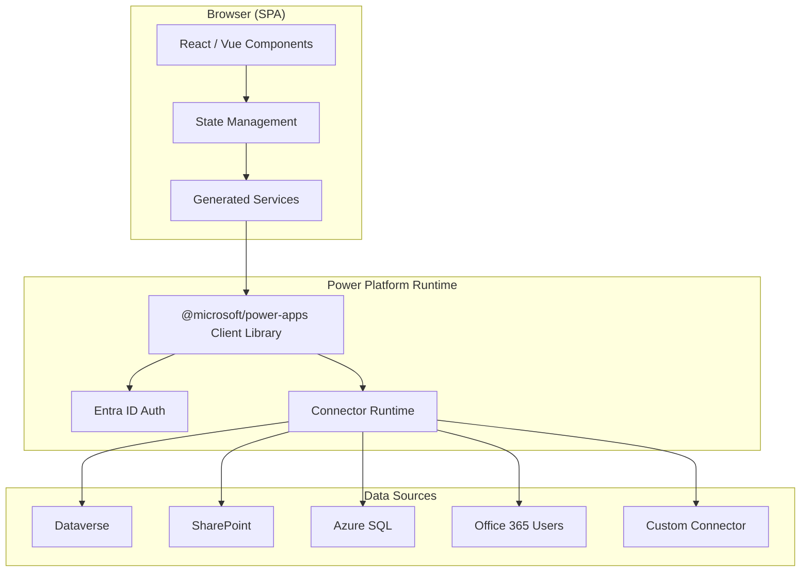

# Phase 2: Solution Architecture

## Purpose

Define the technical shape of the solution — components, hosting model, security
posture, ALM strategy, and integration points — so that data architecture and UI
work proceed from a shared foundation.

## Deliverable

An **Architecture Decision Record (ADR)** document plus a Mermaid component diagram.

## Key Architectural Concepts for Code Apps

### Three Logical Components (Runtime)

When a code app runs, it consists of:

1. **Your SPA** — the HTML/TS/JS app you build (React, Vue, vanilla)
2. **Power Apps Client Library** (`@microsoft/power-apps`) — handles auth, exposes
   connector APIs, manages generated models and services
3. **Power Platform Backend** — connector runtime, Entra auth, DLP enforcement,
   managed hosting

Your code never talks directly to external APIs. All data flows through Power Platform
connectors, which means the platform handles auth tokens, consent, throttling, and DLP.

### Development Architecture

```
your-app/
├── src/                    # Your application code
│   ├── components/         # UI components (React/Vue)
│   ├── pages/              # Route-level views
│   └── generated/          # Auto-generated by pac code add-data-source
│       └── services/       # Typed models + service files per connector
├── power.config.json       # Power Platform metadata (do not edit manually)
├── package.json
└── tsconfig.json
```

The `generated/services/` folder is created and maintained by the CLI when you
add data sources. Each connector produces a `*Model.ts` and `*Service.ts` pair.

### Hosting & Deployment

- `pac code push` compiles your app and publishes it to the Power Platform environment
- The app is hosted by Power Platform — no separate Azure App Service required
- Apps appear in the Power Apps portal and can be shared like canvas apps
- Code apps do NOT run in the Power Apps mobile app or Power Apps for Windows

### Security Model

- Authentication: Microsoft Entra ID (automatic, no code required)
- Authorisation: Connector-level — each connector respects the signed-in user's permissions
- DLP: Enforced at app launch. If a connector violates policy, the app won't start
- Sharing: Follows canvas app sharing limits set by environment admins
- Tenant isolation and Conditional Access are supported

## Decision Points

Walk through these with the user:

### 1. Framework Choice
| Option | When to choose |
|--------|---------------|
| React | Default. Largest ecosystem, best Copilot support, most community samples |
| Vue | Team prefers Vue. Good Copilot support |
| Vanilla TS | Minimal overhead, no framework lock-in, smaller bundle |

### 2. State Management
| Option | When to choose |
|--------|---------------|
| React Context + hooks | Simple apps, <10 data entities |
| Zustand / Jotai | Medium complexity, need shared state across many components |
| Redux Toolkit | Large apps, complex async flows, team already uses Redux |

### 3. Routing
| Option | When to choose |
|--------|---------------|
| React Router | Multi-page SPA with distinct views |
| Single view | Dashboard or form-based app with tabs/panels |

### 4. ALM & Environment Strategy
| Concern | Recommendation |
|---------|---------------|
| Source control | Git repo (GitHub/Azure DevOps), standard branching |
| Environments | Dev → Test → Prod (separate Power Platform environments) |
| CI/CD | `pac code push` in pipeline, or manual for small teams |
| Solution packaging | Code app lives in a Power Apps solution for transport |

### 5. Error Handling & Observability
- Connector errors surface through the generated service methods
- Implement a global error boundary (React) or error handler
- Consider Application Insights for production telemetry (requires custom integration)

## Mermaid Diagram Template

Produce a diagram like this, customised to the user's app:



## Output Template

```markdown
# Architecture Decision Record: [App Name]

## Status
Proposed

## Context
[Why this architecture was chosen]

## Decisions

### Framework: [React / Vue / Vanilla]
**Rationale**: 

### State Management: [Choice]
**Rationale**: 

### Routing: [Choice]
**Rationale**: 

### ALM Strategy
- Source control: 
- Branching: 
- Environments: 
- CI/CD: 

### Security Notes
- DLP policy group: 
- External users: Yes / No
- Conditional Access: 

## Component Diagram
[Mermaid diagram]

## Risks & Mitigations
| Risk | Mitigation |
|------|-----------|
| | |
```

## GitHub Copilot Prompt

```
@workspace I'm building a Power Apps Code App using React and TypeScript.
The app connects to [connectors]. Generate a project folder structure
following best practices with separate folders for components, pages,
hooks, types, and a generated/services folder for Power Platform
connector services. Include placeholder files with JSDoc comments
explaining each folder's purpose.
```

## Transition to Phase 3

Once the architecture is agreed, read `agents/skills/data-structure/SKILL.md` to
design the data layer.
