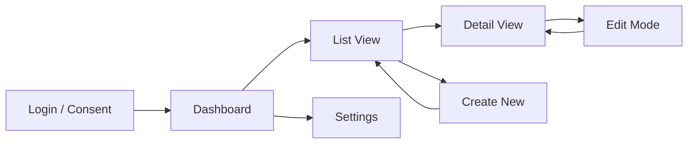

# Phase 4: UI Mockups

## Purpose

Generate real, rendered UI mockups as working code that stakeholders can see and
interact with in a browser. This phase does not produce static wireframes — it produces
actual React/TypeScript (or HTML/CSS) prototypes that look and feel like the final app,
populated with realistic sample data. These mockups become the visual contract between
the developer and the business, and serve as the starting scaffold for Phase 6.

## Deliverable

A set of **working mockup files** — one per view — written in the project's chosen
framework (React TSX by default). Each mockup renders a realistic, interactive layout
with sample data, responsive behaviour, and correct component hierarchy. Mockups are
viewable in a browser via the dev server or as standalone HTML files.

## Core Principle: Generate Real Code, Not Diagrams

Traditional wireframes are ambiguous. A box labelled "Data Table" tells you nothing
about column density, row height, or how a 50-character company name wraps on mobile.

**Instead, the agent must:**

1. Generate each mockup as a working `.tsx` file (or `.html` if standalone)
2. Use the project's chosen component library (Fluent UI React by default)
3. Populate with realistic sample data — not "Lorem ipsum" but plausible entity names,
   dates, statuses, and metrics derived from the data architecture (Phase 3)
4. Include responsive behaviour at all three breakpoints (mobile, tablet, desktop)
5. Include all three data states: loaded, loading (skeleton/spinner), and error
6. Make the mockup interactive — filters filter, tabs switch, navigation works
7. Output files that can be opened directly in a browser or served via `npm run start`

## Mockup Generation Process

### Step 1: Review inputs from earlier phases

Before generating mockups, read and reference:
- **Phase 1 (Brainstorming)**: user personas, core capabilities, device context
- **Phase 3 (Data Architecture)**: entity schemas, field types, relationships,
  realistic row counts — use these to generate sample data
- **Phase 2 (Architecture)**: framework choice, component library, state management

### Step 2: Build the page/view inventory

List every view with its data requirements. This table drives what gets generated:

```markdown
| View | Route | Layout Type | Primary Data | Sample Row Count | Key Interactions |
|------|-------|-------------|--------------|------------------|------------------|
| Dashboard | / | Metric cards + recent list | Aggregates + 5 recent items | — | Click card → list, click item → detail |
| List View | /items | Filter bar + data table | Paginated entities | 25 per page | Filter, sort, select, paginate, create |
| Detail View | /items/:id | Header + field grid + related panel | Single entity + related | 1 + 3–5 related | Edit, save, delete, back |
| Create/Edit Form | /items/new | Sectioned form | Empty / pre-filled entity | 1 | Validate, submit, cancel |
| Settings | /settings | Preference toggles | User profile | 1 | Toggle, save |
```

### Step 3: Generate sample data

Create a `mockData.ts` file with typed, realistic sample data derived from the
Phase 3 entity schemas. This file is shared across all mockups.

**Copilot prompt — generate mock data:**
```
@workspace Using the entity types in #file:src/types/, generate a mockData.ts file
containing realistic sample data for each entity. Include:
- At least 25 items for list views with varied statuses, dates, and names
- Use realistic UK company names, dates within the last 6 months, and plausible metrics
- Include edge cases: very long names, empty optional fields, all status values
- Type the exports so they match the interfaces exactly
Place the file in src/test-utils/mockData.ts
```

### Step 4: Generate each mockup view

Generate each view as a complete, renderable component. The agent should produce
one file per view, each self-contained with sample data imports and all visual states.

---

## Mockup Templates

### Dashboard Mockup

The agent must generate a working dashboard with real metrics, charts, and a recent
items list — not boxes with labels.

**Copilot prompt — dashboard mockup:**
```
@workspace Generate a complete, working DashboardPage.tsx mockup component using
Fluent UI React and TypeScript. It must:

LAYOUT:
- Header bar with app name, breadcrumb, and a user avatar showing "JL" initials
- Left sidebar navigation with icons and labels for: Dashboard, [Entity List], Settings
- Main content area with a 2×2 grid of metric cards and a "Recent Items" section below

METRIC CARDS (use Fluent UI Card):
- Card 1: "Total [Entities]" — show count 247 with a green +12% trend indicator
- Card 2: "Active This Month" — show count 38 with a blue neutral indicator
- Card 3: "Pending Approval" — show count 14 with an amber warning indicator
- Card 4: "Overdue" — show count 3 with a red critical indicator
Each card should be clickable and navigate to a filtered list view.

RECENT ITEMS LIST:
- Show the 5 most recent items from mockData as a compact list
- Each row: entity name, status badge (colour-coded), created date, assigned user
- Clicking a row navigates to the detail view

STATES:
- Default: fully loaded with sample data
- Include a commented-out loading variant using Fluent UI Skeleton/Shimmer
- Include a commented-out error variant using Fluent UI MessageBar

RESPONSIVE:
- Desktop (>1024px): sidebar visible, 2×2 card grid, full recent list
- Tablet (768–1024px): sidebar as overlay, 2×1 card grid
- Mobile (<768px): no sidebar (hamburger menu), single column cards, compact list

Use CSS modules or inline styles. Import sample data from mockData.ts.
The component must render in the browser without any API calls.
```

### List View Mockup

**Copilot prompt — list view mockup:**
```
@workspace Generate a complete, working ListPage.tsx mockup component using
Fluent UI React and TypeScript. It must:

LAYOUT:
- Same app shell (header + sidebar) as the dashboard
- Page title "[Entities]" with a subtitle showing result count "247 items"
- CommandBar with: "New [Entity]" primary button, "Export" secondary, "Refresh" icon
- Filter bar row: SearchBox (full-text), Dropdown for status filter, DatePicker range
- Data table filling the remaining viewport height

DATA TABLE (use Fluent UI DetailsList):
- Columns: Name, Status, Category, Created Date, Assigned To, Actions
- Populate with 25 rows from mockData with varied data
- Name column: clickable link styled, navigates to detail view
- Status column: render as coloured Badge (Active=green, Pending=amber, Closed=grey)
- Actions column: "Edit" and "Delete" icon buttons per row
- Column headers sortable (show sort indicator on Name by default)
- Enable row selection with checkboxes

PAGINATION:
- Footer bar: "Showing 1–25 of 247" with Previous/Next buttons and page size dropdown

FILTER BEHAVIOUR:
- Filters must actually work against the mock data — typing in SearchBox filters
  the displayed rows client-side, status Dropdown filters by status value
- Show "No results found" empty state with illustration when filters match nothing

STATES:
- Default: 25 rows loaded
- Commented-out loading variant: Shimmer rows matching column widths
- Commented-out error variant: MessageBar with retry button
- Commented-out empty variant: centered illustration + "Create your first [entity]" CTA

RESPONSIVE:
- Desktop: full table with all columns
- Tablet: hide Category and Assigned To columns
- Mobile: switch from table to a card list layout (each item as a compact card)

The component must render in the browser without any API calls.
```

### Detail View Mockup

**Copilot prompt — detail view mockup:**
```
@workspace Generate a complete, working DetailPage.tsx mockup component using
Fluent UI React and TypeScript. It must:

LAYOUT:
- Same app shell with breadcrumb: Dashboard > [Entities] > [Entity Name]
- Hero section: entity name as H1, status badge, created/modified dates
- Action bar: "Edit" primary button, "Delete" danger button, "Back to List" link
- Two-column layout below:
  - Left (2/3): field grid showing all entity fields in labelled read-only pairs
  - Right (1/3): related items panel showing linked records from related entities

FIELD GRID:
- Render every field from the entity schema as: Label (grey, small) above Value (black, normal)
- Group fields into logical sections with section headings
- Show lookup fields as clickable links
- Show option set fields as coloured badges
- Show date fields formatted as "15 Mar 2026"
- Show empty optional fields as "—" in muted text

RELATED ITEMS PANEL:
- Section title: "Related [Related Entity]" with a count badge
- Compact list of 3–5 related items, each showing: name, status, date
- "View All" link at the bottom

EDIT MODE:
- Clicking "Edit" toggles each field from read-only to editable form controls
- Show Save and Cancel buttons in place of Edit when in edit mode
- This must actually toggle state — not just be a separate component

STATES:
- Default: single record loaded from mockData
- Commented-out loading: Skeleton lines matching field layout
- Commented-out error: "Record not found" with back button
- Commented-out delete confirmation: Dialog with warning message

RESPONSIVE:
- Desktop: two-column (fields + related panel)
- Tablet: single column, related panel below fields
- Mobile: compact single column, collapsible field sections

The component must render in the browser without any API calls.
```

### Create/Edit Form Mockup

**Copilot prompt — form mockup:**
```
@workspace Generate a complete, working CreateEditForm.tsx mockup component using
Fluent UI React and TypeScript. It must:

LAYOUT:
- Page title: "New [Entity]" (or "Edit [Entity Name]" when editing)
- Form organised into sections with section headings
- Two-column layout for fields on desktop, single column on mobile
- Sticky footer bar with: "Save" primary button, "Cancel" secondary button

FORM FIELDS (derive from Phase 3 entity schema):
- Text fields: Fluent UI TextField with label, placeholder, required indicator
- Dropdowns: Fluent UI Dropdown populated with realistic option values
- Date fields: Fluent UI DatePicker with sensible defaults
- Lookup fields: Fluent UI ComboBox with search-as-you-type against mock data
- Number fields: SpinButton with min/max constraints
- Multi-line text: TextField with multiline prop and character counter

VALIDATION:
- Required fields show red border and error message on blur if empty
- Email fields validate format
- Date fields validate logical ranges (end date after start date)
- Form-level validation on submit — scroll to first error and focus it
- Validation must actually work in the browser against real state

SUBMIT BEHAVIOUR:
- On valid submit: show a success Toast ("Record created successfully") and
  clear the form (or navigate back in edit mode)
- Save button disabled while any required field is empty

STATES:
- Create mode: empty form with placeholders
- Edit mode: pre-populated from mockData (pass a boolean prop to toggle)
- Submitting: Save button shows a Spinner and is disabled

RESPONSIVE:
- Desktop: two-column field layout
- Mobile: single column, full-width fields

The component must render in the browser without any API calls.
All validation and interaction must be functional.
```

---

## Generating Standalone Mockup Files

If the project isn't scaffolded yet (no `npm run start`), generate mockups as
standalone HTML files that open directly in a browser:

**Copilot prompt — standalone HTML mockup:**
```
@workspace Generate a standalone HTML file for the Dashboard mockup that:
- Includes Fluent UI React via CDN (unpkg)
- Includes React and ReactDOM via CDN
- Contains all component code inline in a <script type="text/babel"> block
- Includes all sample data inline
- Is a single file that opens directly in a browser with no build step
- Looks identical to what the final app will look like
Save as mockups/dashboard.html
```

## Navigation Flow Diagram

In addition to the rendered mockups, produce a Mermaid navigation flow diagram
showing how views connect:



## Component Tree

Map the UI into a component hierarchy. This directly maps to your `src/components/`
and `src/pages/` folder structure.

```
App
├── Layout
│   ├── Header
│   │   ├── Logo
│   │   ├── NavBreadcrumb
│   │   └── UserMenu
│   ├── Sidebar
│   │   └── NavLinks
│   └── MainContent (router outlet)
├── Pages
│   ├── DashboardPage
│   │   ├── MetricCard (×n)
│   │   └── RecentItemsList
│   ├── ListPage
│   │   ├── FilterBar
│   │   ├── DataTable
│   │   │   └── DataRow (×n)
│   │   └── Pagination
│   ├── DetailPage
│   │   ├── DetailHeader
│   │   ├── DetailFields
│   │   └── RelatedItemsPanel
│   └── CreateEditForm
│       ├── FormField (×n)
│       ├── LookupPicker
│       └── SubmitBar
└── Shared
    ├── LoadingSpinner
    ├── ErrorBoundary
    ├── EmptyState
    ├── ConfirmDialog
    └── Toast / Notification
```

## Responsive Breakpoints

| Breakpoint | Width | Layout Change |
|-----------|-------|---------------|
| Mobile | <768px | Sidebar collapses to hamburger menu, single column |
| Tablet | 768–1024px | Sidebar as overlay, two-column where possible |
| Desktop | >1024px | Full sidebar, multi-column layouts |

## Theming & Branding

- **Fluent UI**: use `FluentProvider` with a custom theme token set matching the
  organisation's brand colours
- **CSS approach**: CSS-in-JS (styled-components, Emotion) or Tailwind utility classes
- Define a `theme.ts` with colour tokens, spacing, and typography
- Ask the stakeholder for brand colours and logo before generating mockups — apply
  them to every mockup for realistic sign-off

## Loading & Error States

Every mockup must include all three data states, either as toggleable variants or
as commented-out code blocks that can be swapped in:

1. **Loading**: skeleton screens or shimmer matching the exact layout of the loaded state
2. **Error**: friendly message with retry action, styled consistently
3. **Empty**: illustration + call-to-action ("No items yet. Create your first one.")

## Mockup Review Workflow

Once mockups are generated:

1. **Run them locally**: `npm run start` or open standalone HTML in browser
2. **Screen share with stakeholders**: walk through each view on desktop AND mobile
3. **Capture feedback**: note changes directly against the mockup component name
4. **Iterate**: update the mockup `.tsx` files, re-run, re-review
5. **Sign off**: mockups become the visual baseline — commit them to the repo

Mockup files can live in `src/mockups/` during design, then be refactored into
actual page components in Phase 6 by replacing mock data with real service calls.

## Mockup-to-Production Conversion

Each mockup is designed to convert cleanly into a production component:

| Mockup pattern | Production replacement |
|----------------|----------------------|
| Import from `mockData.ts` | Import from `generated/services/*Service.ts` |
| Hardcoded sample arrays | `useConnectorQuery()` hook with real service call |
| `useState` for filters | Same — filters drive `$filter` param on service call |
| `onClick={() => navigate()}` | Same — React Router navigation stays |
| Inline styles / CSS modules | Same — keep or migrate to theme tokens |

The agent should annotate each mockup with `// TODO: Replace with real service call`
comments at every point where mock data is used, making Phase 6 conversion mechanical.

## GitHub Copilot Prompts — Additional

### Generate all mockups in sequence
```
@workspace Using the entity schemas in #file:src/types/ and the sample data in
#file:src/test-utils/mockData.ts, generate complete mockup components for every
view in the page inventory. Each mockup must:
- Use Fluent UI React components with TypeScript
- Render with realistic sample data (no placeholder text)
- Be responsive at mobile, tablet, and desktop breakpoints
- Include loading, error, and empty state variants (commented out)
- Include TODO comments where mock data will be replaced with real services
Generate: DashboardPage.tsx, ListPage.tsx, DetailPage.tsx, CreateEditForm.tsx
Place them in src/mockups/
```

### Convert a mockup to production
```
@workspace Convert #file:src/mockups/ListPage.tsx into a production component:
- Replace mock data imports with calls to the generated service in
  #file:generated/services/DataverseService.ts
- Use the useConnectorQuery hook from #file:src/hooks/useConnectorQuery.ts
- Wire up filters to pass $filter and $orderby to the service call
- Keep all UI, layout, and responsive behaviour identical
- Remove mockData imports and TODO comments
Save to src/pages/ListPage.tsx
```

## Transition to Phase 5

With rendered, interactive mockups reviewed and signed off, read
`agents/skills/connectors/SKILL.md` to plan which connectors and data sources
the app needs, and how to wire them up.
