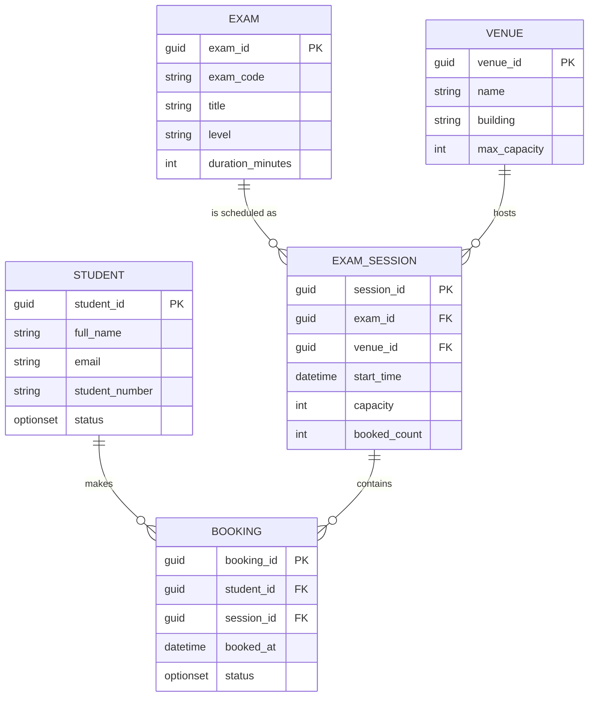
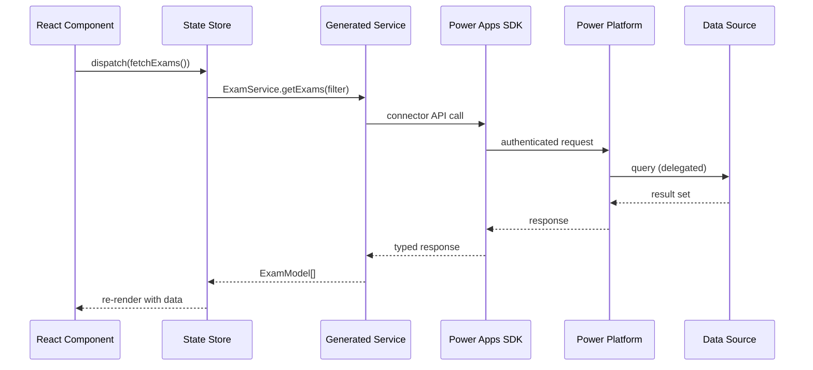

# Phase 3: Data Architecture

## Purpose

Design the data layer: which data sources to use, table schemas, relationships,
delegation boundaries, and how data flows through the app. This phase directly
informs which connectors are needed (Phase 5) and how the UI binds to data (Phase 4).

## Deliverable

A **Data Architecture Document** containing an entity-relationship diagram, table
definitions, data flow diagram, and delegation/performance notes.

## Data Source Selection Guide

Code apps access data exclusively through Power Platform connectors. The choice of
backing data source has major implications for performance, delegation, and licensing.

### Primary Data Source Comparison

| Data Source | Delegation | Relational | Offline | Licensing | Best For |
|-------------|-----------|------------|---------|-----------|----------|
| **Dataverse** | Full | Yes (lookups, relationships) | Via platform | Premium connector | Enterprise apps, D365 integration, complex data models |
| **SharePoint Lists** | Limited (views, indexing) | Weak (lookups only) | No | Standard connector | Document-centric apps, team collaboration, <5k rows |
| **Azure SQL** | Full (via custom connector or SQL connector) | Yes | No | Premium connector | Large datasets, existing SQL infrastructure, complex queries |
| **Excel (OneDrive)** | None | No | No | Standard connector | Prototyping only. Never use for production |
| **Custom Connector (REST API)** | Depends on API | Depends on API | No | Premium | Integration with external systems, custom backends |

### Decision Framework

Ask the user:

1. **How many rows** will the largest table contain?
   - <2,000 rows → almost anything works
   - 2,000–100,000 → need delegation support (Dataverse or SQL)
   - >100,000 → Dataverse or SQL required, consider server-side pagination

2. **Is there an existing data store?** If the data already lives in Dataverse (e.g.,
   D365 CE), SQL Server, or SharePoint, prefer connecting to it rather than duplicating.

3. **Do you need relational integrity?** Lookups, cascading deletes, calculated fields
   → Dataverse. Simple flat lists → SharePoint may suffice.

4. **What's the DLP policy?** Some environments restrict which connectors can be used
   together. Verify before designing.

5. **Are there existing model-driven apps or canvas apps** accessing the same data?
   Dataverse is the natural choice for shared data.

## Entity-Relationship Diagram

Produce an ER diagram in Mermaid. Example for an exam booking system:



## Table Definition Template

For each entity, document:

```markdown
### Table: [Name]

| Column | Type | Required | Notes |
|--------|------|----------|-------|
| | | | |

**Primary key**: 
**Relationships**: 
**Indexes / Views**: 
**Delegation notes**: [which filter/sort operations are delegable]
**Row estimate**: 
**Security**: [table-level, column-level, row-level (Dataverse business units)]
```

## Data Flow Diagram

Show how data moves from source → connector → generated service → component state → UI.



## Performance & Delegation Checklist

Before finalising the data architecture, verify:

- [ ] All list views use delegable filter/sort operations for the chosen data source
- [ ] No table exceeds the non-delegable limit without a delegable query pattern
- [ ] Pagination strategy defined for large result sets
- [ ] Write operations (create, update, delete) mapped to the correct service methods
- [ ] Optimistic vs pessimistic concurrency decided for edit scenarios
- [ ] Caching strategy defined (in-memory, stale-while-revalidate, none)
- [ ] Offline behaviour defined (code apps don't natively support offline — document workarounds if needed)

## Dataverse-Specific Considerations

If using Dataverse:
- Use **solution-aware tables** so they transport across environments
- Define **business rules** or **real-time workflows** for server-side validation
- Use **alternate keys** if external systems need to reference records
- Consider **virtual tables** to surface external data (SQL, SAP) through Dataverse
- Use **security roles** and **business units** for row-level security
- Column-level security profiles for sensitive fields

## GitHub Copilot Prompt

```
@workspace Based on this entity-relationship diagram: [paste mermaid ER].
Generate TypeScript interfaces for each entity. Include JSDoc comments,
use guid type aliases, and add utility types for create/update operations
that omit auto-generated fields. Place files in src/types/.
```

## Transition to Phase 4

With the data model defined, read `references/04-ui-mockups.md` to design the
user interface that will consume this data.
