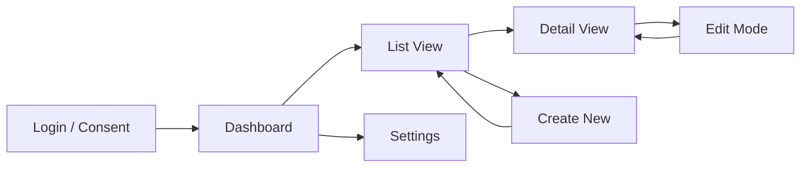

# Phase 4: UI Mockups

## Purpose

Design the user interface before writing component code. This phase produces
wireframes, a component hierarchy, responsive layout rules, and navigation flow.
The output gives GitHub Copilot enough context to generate accurate component scaffolding.

## Deliverable

A **UI Specification** containing: page/view inventory, wireframes (ASCII or SVG),
component tree, responsive breakpoints, and a navigation map.

## Design Principles for Code Apps

Because code apps are full SPAs, you have complete control over the UI — there is no
Power Apps form designer or gallery control. This is both a freedom and a responsibility.

### Key constraints to remember:
- Code apps run in a browser only (no Power Apps mobile app support)
- The app loads inside the Power Apps player frame — account for that chrome
- Entra auth consent dialogs appear on first launch — design an appropriate loading state
- Connector permissions prompt on first use — design graceful consent flows

### Recommended UI approach:
- Use a component library for consistency: Fluent UI React (Microsoft's design system)
  is the natural fit, but Shadcn/UI, Radix, or MUI also work
- Design mobile-responsive from the start — users will access via mobile browsers
- Follow WCAG 2.1 AA accessibility standards as a baseline
- Keep page weight low — the Power Apps player adds overhead

## Page / View Inventory

List every distinct view in the app:

```markdown
| View | Route | Purpose | Data Needed | User Actions |
|------|-------|---------|-------------|--------------|
| Dashboard | / | Overview metrics and quick actions | Summary counts, recent items | Navigate to detail views |
| List View | /items | Browse and filter items | Paginated item list | Filter, sort, select, create new |
| Detail View | /items/:id | View and edit a single item | Full item record + related | Edit, save, delete, navigate back |
| Create Form | /items/new | Create a new item | Empty form + lookup options | Fill form, validate, submit |
| Settings | /settings | User preferences | User profile | Update preferences |
```

## Wireframe Approach

Produce wireframes in one of these formats, depending on the user's preference:

### Option A: ASCII Wireframes (fastest, works in any context)

```
┌─────────────────────────────────────────────────┐
│  [Logo]   App Name          [User Avatar] [⚙]  │
├────────┬────────────────────────────────────────┤
│        │                                        │
│  Nav   │   Page Content Area                    │
│        │                                        │
│  📊 Dash│   ┌──────────┐ ┌──────────┐          │
│  📋 List│   │  Card 1   │ │  Card 2   │          │
│  ⚙ Set │   │  metric   │ │  metric   │          │
│        │   └──────────┘ └──────────┘          │
│        │                                        │
│        │   ┌────────────────────────────────┐   │
│        │   │  Data Table / List              │   │
│        │   │  ┌─────┬─────┬─────┬──────┐   │   │
│        │   │  │Name │Date │Status│Action│   │   │
│        │   │  ├─────┼─────┼─────┼──────┤   │   │
│        │   │  │     │     │     │ Edit │   │   │
│        │   │  └─────┴─────┴─────┴──────┘   │   │
│        │   └────────────────────────────────┘   │
└────────┴────────────────────────────────────────┘
```

### Option B: React/SVG Artifact (richer, interactive)

Create an SVG or React artifact that renders the wireframe with clickable areas.
Use the frontend-design skill for polished mockups if the user wants high fidelity.

### Option C: Mermaid User Flow

For navigation flow rather than layout:



## Component Tree

Map the UI into a component hierarchy. This directly maps to your `src/components/`
and `src/pages/` folder structure.

```
App
├── Layout
│   ├── Header
│   │   ├── Logo
│   │   ├── NavBreadcrumb
│   │   └── UserMenu
│   ├── Sidebar
│   │   └── NavLinks
│   └── MainContent (router outlet)
├── Pages
│   ├── DashboardPage
│   │   ├── MetricCard (×n)
│   │   └── RecentItemsList
│   ├── ListPage
│   │   ├── FilterBar
│   │   ├── DataTable
│   │   │   └── DataRow (×n)
│   │   └── Pagination
│   ├── DetailPage
│   │   ├── DetailHeader
│   │   ├── DetailFields
│   │   └── RelatedItemsPanel
│   └── CreateEditForm
│       ├── FormField (×n)
│       ├── LookupPicker
│       └── SubmitBar
└── Shared
    ├── LoadingSpinner
    ├── ErrorBoundary
    ├── EmptyState
    ├── ConfirmDialog
    └── Toast / Notification
```

## Responsive Breakpoints

| Breakpoint | Width | Layout Change |
|-----------|-------|---------------|
| Mobile | <768px | Sidebar collapses to hamburger menu, single column |
| Tablet | 768–1024px | Sidebar as overlay, two-column where possible |
| Desktop | >1024px | Full sidebar, multi-column layouts |

## Theming & Branding

- **Fluent UI**: use `FluentProvider` with a custom theme token set matching the
  organisation's brand colours
- **CSS approach**: CSS-in-JS (styled-components, Emotion) or Tailwind utility classes
- Define a `theme.ts` with colour tokens, spacing, and typography

## Loading & Error States

Every view that fetches data must have three states designed:

1. **Loading**: skeleton screens or spinner (never a blank page)
2. **Error**: friendly message with retry action
3. **Empty**: illustration + call-to-action ("No items yet. Create your first one.")

## GitHub Copilot Prompts

### Generate a page component
```
@workspace Create a React component for the ListPage that:
- Fetches data from [ServiceName] using the generated service
- Displays results in a Fluent UI DetailsList
- Includes a SearchBox filter that filters client-side
- Shows a Spinner during loading and a MessageBar on error
- Has a "New Item" CommandBarButton that navigates to /items/new
Use TypeScript, functional components with hooks.
```

### Generate a form component
```
@workspace Create a React form component for creating a new [Entity] that:
- Uses Fluent UI form controls (TextField, Dropdown, DatePicker)
- Validates required fields before submission
- Calls [ServiceName].create() with the form data
- Shows a success Toast and navigates back to the list on success
- Handles and displays API errors
```

## Transition to Phase 5

With the UI designed, read `references/05-connectors.md` to plan which connectors
and data sources the app needs, and how to wire them up.
